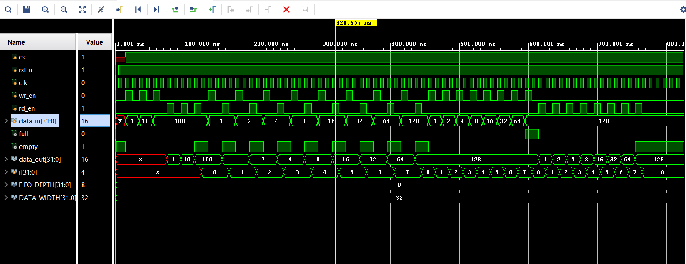

# Synchronous_FIFO_Design

A parameterized **Synchronous FIFO (First-In-First-Out)** designed using **Verilog HDL**.  
The FIFO supports independent read and write controls, configurable data width and FIFO depth, and generates **full** and **empty** status flags.

---

## Features

- Synchronous FIFO architecture
- Parameterized FIFO depth and data width
- Separate read and write pointers
- `full` and `empty` status flags
- Chip-select based read/write control
- Active-low reset
- Prevents write operation when FIFO is full
- Prevents read operation when FIFO is empty
- Waveform-based functional verification

---

## Design Parameters

The FIFO is configured using two parameters:

parameter FIFO_DEPTH = 8;
parameter DATA_WIDTH = 32;

## Simulation

The RTL was verified through digital simulation by monitoring:

- Write pointer
- Read pointer
- FIFO data
- `full` flag
- `empty` flag
- Read/write enable signals
- Output data

The simulation confirms correct FIFO behavior and proper handling of boundary conditions.

### Simulation Result

The waveform above shows the functional simulation of the synchronous FIFO, including read/write operations, pointer movement, and `full`/`empty` flag behavior.
